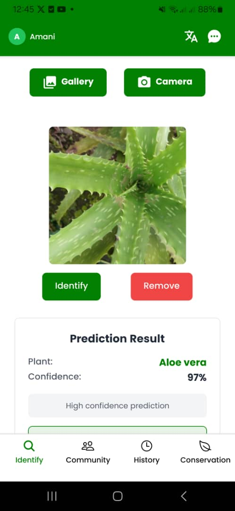

# Misala App
## 1. **About the Project**
Misala is an ML-powered mobile app that automates the identification and multilingual documentation of traditional African medicinal plants, preserving indigenous knowledge, promoting biodiversity conservation, and enhancing community health.

The project consists of:
- African medicinal plant identification model
- NLP Rule-Based Chatbot
- Reinforcement learning + identification model for drone simulation

### Research Proposal(05/28/2025)

[PROPOSAL](https://docs.google.com/document/d/1RpQLqegaGXdicoSxc8O93Bt4YJyuiTJr/edit?usp=sharing&ouid=116463373145295427131&rtpof=true&sd=true)

### Research Proposal Ethics(06/26/2025)

[ETHICS](https://docs.google.com/document/d/1k04BnqFJsXRbZZnlnVRXHFbMtiW8qRHyvEXEWvozRh0/edit?usp=sharing)

### Research Report(07/18/2025)

[REPORT](https://docs.google.com/document/d/1Q4uR6goaZxUQDYBmiPQxomWPxmpqAflu/edit?usp=sharing&ouid=116463373145295427131&rtpof=true&sd=true)


---

## 2. **Initial Software Product/Solution Demonstration(06/08/2025)**

### GitHub Repo

[REPO](https://github.com/cynthianekesa/Misala-App.git)

### Plant identification model
- 26 classes with 6535 images already split into 81% train, 11% validate, and 8% test data taken in different lighting and weather conditions, while taking into consideration both healthy and diseased plant parts for a non-biased model

- Overview of initial metrics, sizes, and aspect ratios of the images in the dataset


- Test Accuracy: `0.9382274150848389` and Test Loss: `0.21622663736343384`(MobileNet)

- Training and validation accuracy vs loss

  

- Trained models converted to TensorFlow Lite format to enable offline access

- GPU crashed while doing approach 2 training(Xception model)


### NLP Rule-Based Chatbot
- Used the NLTK library because it's lightweight, easy to use, and can enable offline access of the model

- Initial example of chatbot behaviour
  


### Reinforcement learning for plant identification using drones
- This unique use case popped up during research and was also motivated by 3.2 summative work.

- Initial environment(to be developed further)


- Going forward, is to add more actions, improve the GUI of the environment, and integrate the plant identification trained model.


### Environment and Project Setup
To set up the environment and run the project, follow these steps:

- Clone the repository

```bash
git clone https://github.com/cynthianekesa/Misala-App.git
cd Misala-App
Here you will have access to the Google Colab notebooks, hence you can view Explatory Data Analysis(EDA) and test model performance either by opening the notebook to lead you directly to Google Colab or using Visual Studio Code as it is.
The Google collabs can be accessed directly on GitHub, too
```

- View the Figma design of the proposed mobile app through the link in the readme.

### Design
[FIGMA FILE](https://www.figma.com/design/cL08VX67cx0oN2h7fJSvVV/Misala-App-Design?node-id=0-1&t=pYkBzYITdCOZpBm0-1)

[PROTOTYPE LINK](https://www.figma.com/proto/cL08VX67cx0oN2h7fJSvVV/Misala-App-Design?node-id=0-1&t=pYkBzYITdCOZpBm0-1)


### Deployment Plan
- Models to be hosted on Roboflow and also accessible offline

- Misala Mobile App to be accessible offline and also online via an affordable cloud provider

- Models to be integrated with the Misala Mobile App for a good user experience and interaction with the solution

### Video Demo
[DEMO 1:Models](https://www.loom.com/share/007481837e0f4ddda5fd425de281479e?sid=d97121a0-03b0-4cd6-b275-92f2724913d6) 

[DEMO 2:Figma design](https://www.loom.com/share/ccedd95b5ca045d48458f4decce47efe?sid=c0ac3196-f3dd-42a8-8dff-0aa1d3c94416) 

---

## 3. **Final Version of Product/Solution(07/07/2025)**: Testing, Analysis, Discussion, and Recommendations

### Plant Identification Model

- Data Quality


- Vanilla model & use of optimization techniques
  - Vanilla model performed poorly and on using optimization techniques still got the same results despite using a lot of resources
  - This led to opting for pre-trained image models and fine tuning them with my data since most of them are trained on western images with less focus on medicinal plants
  - Alexnet could also have been a good option but I didn't get to explore it
    
- MobileNetV2 Base Model Option 1
  - Model that was eventually hosted and used for the mobile app and reinforcement learning. Created a FASTAPI for the model and hosted on render(free tier). Documentations and link         found in the `README.md` of the 'plant identification model' folder.
  - Test Accuracy: `0.9382274150848389` and Test Loss: `0.21519993245601654`
  - Model Summary
  
  
- MobileNetV2 Base Model Option 2
  - Model performed close to option 1 on test dataset
  - Final training accuracy: `0.9205357432365417` and Final validation accuracy: `0.38155514001846313`
  - Model Summary
  
  
- Xception Base Model
  - Model provided good results for partitioned data but on testing it performed very poorly
  - Accuracy: `0.9990` and loss: `0.0070`
  - Model Summary
  
  
  - Model accuracy and loss graph
  
  
- Resnet
  - Training accuracy and loss was too low
  - Model Image
  
  
  - Training and validation accuracy/loss
  
  
- InceptionV3, EfficientNet Base Model and VGG16
  - The three equally performed poorly


### MisalaBot
- I figured out training an NLP rule-based chatbot using the NLTK library as demonstrated in the google colab notebook in the MisalaBot folder was too rigid for what I wanted the chatbot to deliver. If I was to try to make it not rigid(self-learning), then I needed an [intents.json] file for the chatbot which was not easy to make for the case of african medicinal plants. Also, incorporating the trained chatbot on a mobile app would be a real hassle.
- The second option was to design a simple GUI using the Python Tkinter module where a text box is created and button to submit user intent and on the action, a function is built where  user intent is matched so as to be responded to.
- I didn't use either of the above options and instead opted to creating a customized chatbot for african medicinal plants using botpress. Dialogue flows and rules of the chatbot are found in the 'instructions.md' file in the misalabot folder.
- The role of the bot includes:

  **Contextual Q&A and clarification**: Explain unfamiliar terms or break down preparation steps if the user is confused. e.g

  User: “What does decoction mean?”
  
  Bot: “Decoction means boiling plant parts (like bark or roots) in water to extract the medicine.”
  
  **Usage guidance based on symptoms**: This makes the app feel like a helper, not just a database. e.g

  User: “What plant helps with toothache?”
  
  Bot: “You can try clove or guava leaf. Would you like to scan one of them?”
  
  **Side effects and warnings**: e.g

  User: “Can I take this if I’m pregnant?”
  
  Bot: “This plant is not recommended during pregnancy. Please consult a trained herbalist.”
  
  **Cultural and traditional wisdom**: The chatbot will enrich the experience by offering extra context hence cultural preservation. e.g

  User: “How was this used traditionally?”
  
  Bot: “Among the Bukusu, holy basil was burned to ward off evil spirits, aside from its medicinal uses.”
  
  **Navigation support**: e.g

  User: “Where is the Community Wisdom section?”
  
  Bot: “Tap the bottom menu and select the community icon.”

- Link to hosted bot:
  
  - https://cdn.botpress.cloud/webchat/v3.0/shareable.html?configUrl=https://files.bpcontent.cloud/2025/07/03/12/20250703121251-4H17SV03.json

- Chatbot behaviour:


### Drone Simulation
- Improved environment from initial submission:


- Saved PPO model trained on Cnn policy under epsilon-greedy Q algorithmn is saved in the `Drone Simulation` folder together with the logs, checkpoints and tensorboard progress.

- Drone plant identification using saved policy in a gif is found in the `Data` folder. This gif shows the potential of using ML together with drone technology to enable identification of ATM in places where phones can't be used. Building upon this would be to fine-tune the PPO policy to perform even better.

- Average reward over 10 episodes:
- Intepretation of graph can be found in the research report.


 
### Misala Mobile App

**A. Testing**
- Testing strategies: Explained in detail in the research report.
  - Unit testing
  - Integration testing
  - Validation testing
  - Functional and system testing
  - Acceptance testing

- Screenshots of testing with different data values and software/hardware specifications

<table>
  <tr>
     <td>App Icon</td>
     <td>Registration Page</td>
     <td>Terms and Conditions </td>
     <td>Sign in Page</td>
     <td>Edit Profile</td>
     <td>Take Image</td>
     <td>Prediction Page</td>
     <td>Predicted Plant Info</td>
     <td>Plant Prediction History</td>
     <td>Report Prediction</td>
     <td>Uploading Plant Remedy</td>
     <td>Sustainable Harvesting</td>
     <td>ATM GuideBooks</td>
     <td>Blog Page</td>
     <td>Misala Bot</td>
  </tr>
  <tr>
    <td></td>
    <td></td>
    <td></td>
    <td></td>
    <td></td>
    <td></td>
    <td></td>
    <td></td>
    <td></td>
    <td></td>
    <td></td>
    <td></td>
    <td></td>
    <td></td>
    <td></td>
  </tr>
</table>

**B. Analysis**
- Overall objective of the project which was to "To develop an ML-powered mobile app that identifies African traditional medicinal plants and provides verified information(name, ailment treated, mode of preparation/administration) in English and Luhya in order to preserve indigenous knowledge, conserve biodiversity, and improve community health." was achieved.
- The deiverables defined as inscope in the project proposal as well as supporting research questions were all achieved.
- Among proposed functional features, I missed incorporating:
  - User Testimonials
  - Multi-organ identification(partially fulfilled based on available data)
  - Offline mode for plant identification(partially fulfilled)
  - Allowing users to bookmark their favourite identified plants
- Among non-functional requirements, I missed incorporating:
  - Plant identification processing in <5 seconds because of using render free tier
- Among ethical considerations, I missed incorporating:
  - Data retention policy where EXIF metadata of images is not deleted leaving orphaned images that might pose a privacy risk for users.
  - Giving benefit-sharing clause to community herbalists to sign
  - Local processing of sensitive data

**C. Discussion**
- A detailed discussion on the importance of the milestones and the impact of the results with the supervisor can be found in the link below under meeting 3.

  - https://docs.google.com/document/d/1YIj5ygNOFcORUX8FpwQec8UcGWwMOHqyCTcVhAcK0jo/edit?usp=sharing

**D. Recommendations**

- *Use Cases*
  - Herbal Medicine Identification: Helping people identify medicinal plants for traditional remedies and herbal medicine preparation.
  - Botanical Research: Assisting botanists and researchers in studying plant species diversity and distribution for conservation efforts.
  - Pharmacological Studies: Supporting pharmacologists in understanding the therapeutic properties of different plants for drug discovery and development.
  - Medical Education: Providing educational resources for students and healthcare professionals to learn about medicinal plants and their uses.
  - Consumer Safety: Ensuring consumers can accurately identify and use medicinal plants without the risk of misidentification or harmful effects.

- *Future Work*
  - Showing active ingredients and constituents of the medicinal plants.
  - When a plant is identified, a video of its preparation and quantity is included, and also tells if the plant is endangered.
  - A discussion forum for users to get more clarity from ATM specialists if needed(available to premium users).
  - Telemedicine scheduling feature with ATM professionals(premium feature).
  - Access to specialized and localized ATM guidebooks(premium feature).  
  - Gamification of the app, such that users can get rewards for contributing data.
  - More research into machine learning use cases in studying the molecular and structural composition of medicinal plants for use in viral diseases.
  - Write a research paper on the use of drones in identifying medicinal plants in large plantations like forests.
  - Incorporating user feedback during testing.

### Video Demo and apk

- https://drive.google.com/drive/folders/1t8IZyRJ25tv2JuG1cWdDpuUVNPzhJMHn?usp=drive_link

### Environment and Project Setup
- Every directory has project setup procedures.

### Contribution
- Please make a pull request before contributing or email `c.nekesa@alustudent.com` incase of any inquiries.

---

